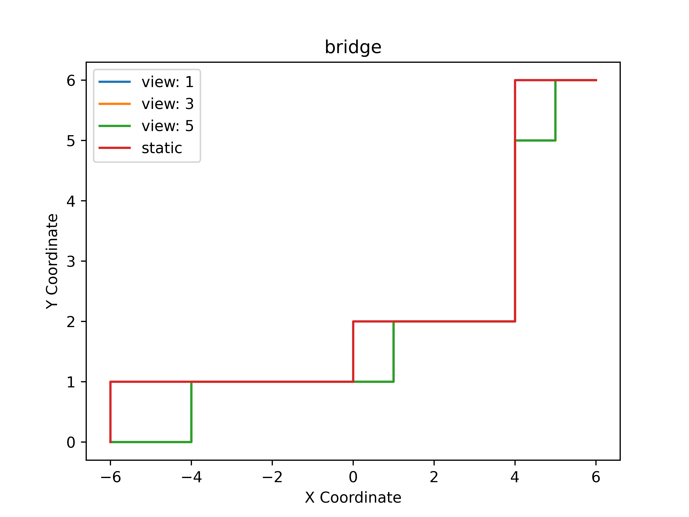
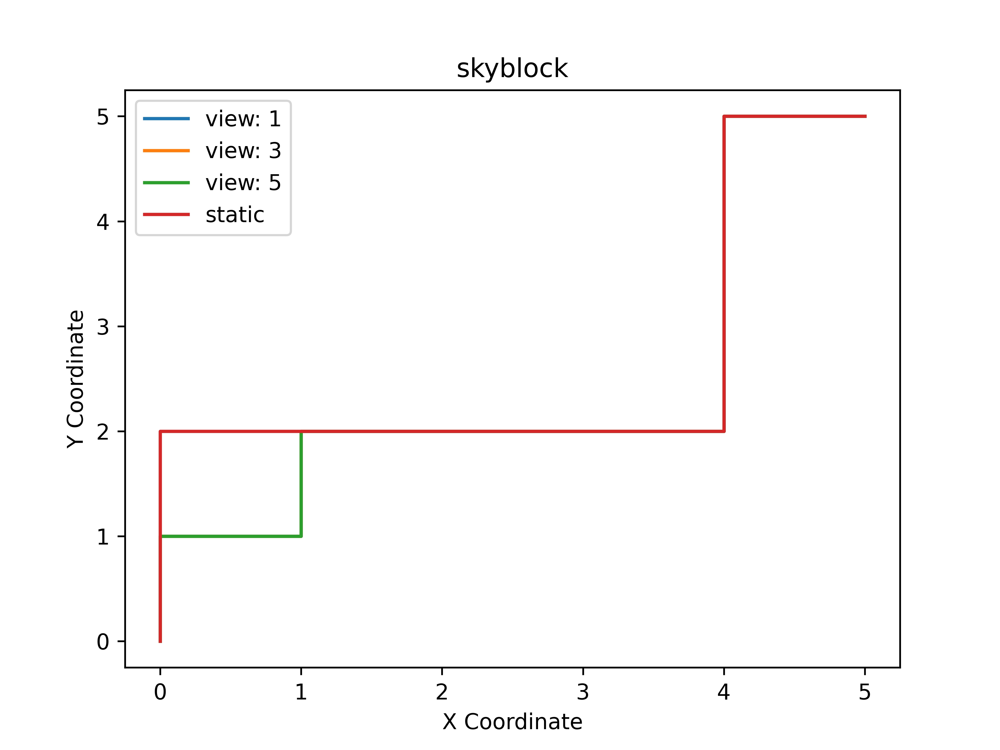
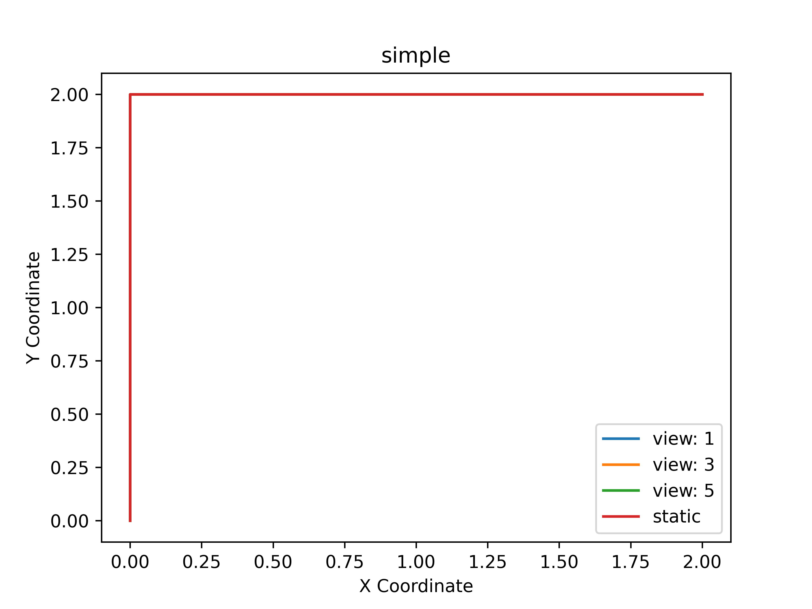
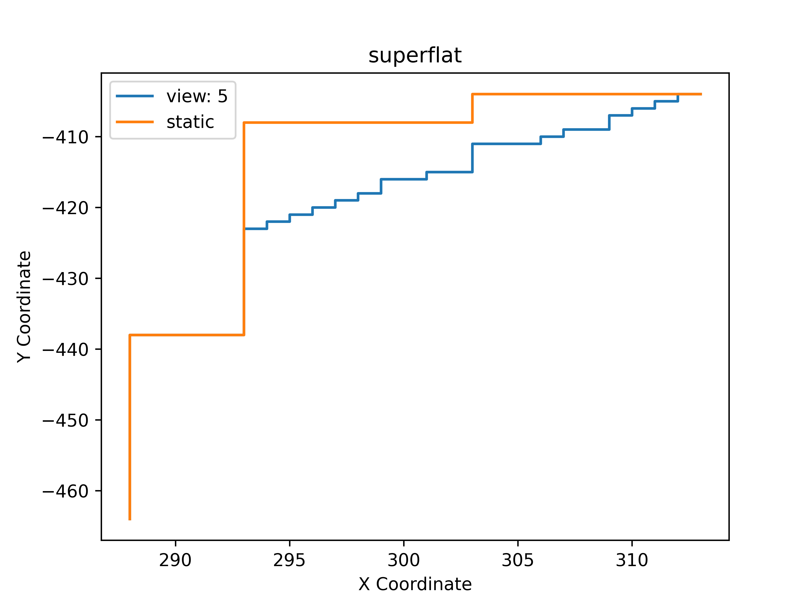

# CSE202WI24-proj

This is a project repo for CSE202, winter 2024.

We focus on solving pathfinding problems in Minecraft, a well-known sandbox game.

## Benchmark

credit: Yuchen, [https://github.com/DuckDuckWhaleUCSD](https://github.com/DuckDuckWhaleUCSD)

The Minecraft map data is under the `benchmark` folder. We have a manually designed `simple` which consists of 11 blocks, and four other benchmarks `bridge`, `road`, `skyblock`, `superflat` imported from real Minecraft maps by using a custom Minecraft client. The client prefers not to be open-sourced and thereby not presented here.

#### Example

|            simple            |            bridge            |           road           |             skyblock             |             superflat             |
| :--------------------------: | :--------------------------: | :----------------------: | :------------------------------: | :--------------------------------: |
|  |  |  |  |  |

## Stateful A* pathfinding

credit: Dawei Guo, [https://github.com/MronakX](https://github.com/MronakX)


The modified A* algorithm with resource constraint is implemented in `stateful-pathfind.ipynb`, where we also implemented a baseline ordinary A* algorithm.


Modify the following line to whatever benchmark you want to test. Also, customize the starting point and goal point to adapt the data.

```
world_txt_filename = 'benchmark/superflat/world-dump.txt'
```

#### Path Example (on x-y plane)

##### Simple

|           A*           |       Stateful A*       |
| :---------------------: | :---------------------: |
|  |  |

##### superflat

|            A*            |       Stateful A*       |
| :----------------------: | :----------------------: |
|  |  |

## Realtime update

credit: Yulin Liu [Yulin Liu&#39;s github page](https://github.com/liuyulinn)

We implement a mimic "real-time update" in RealTimeGraph class in real_time_builder.py and test cases in plot_path.py

Results:

|      |     |
| ------------------------------------- | ---------------------------------------- |
|  |  |
