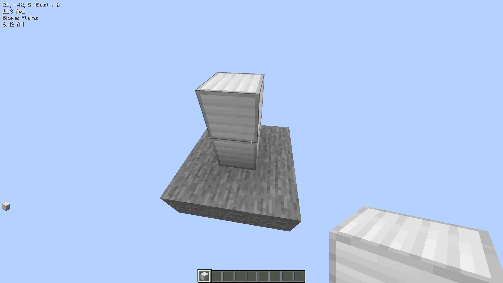
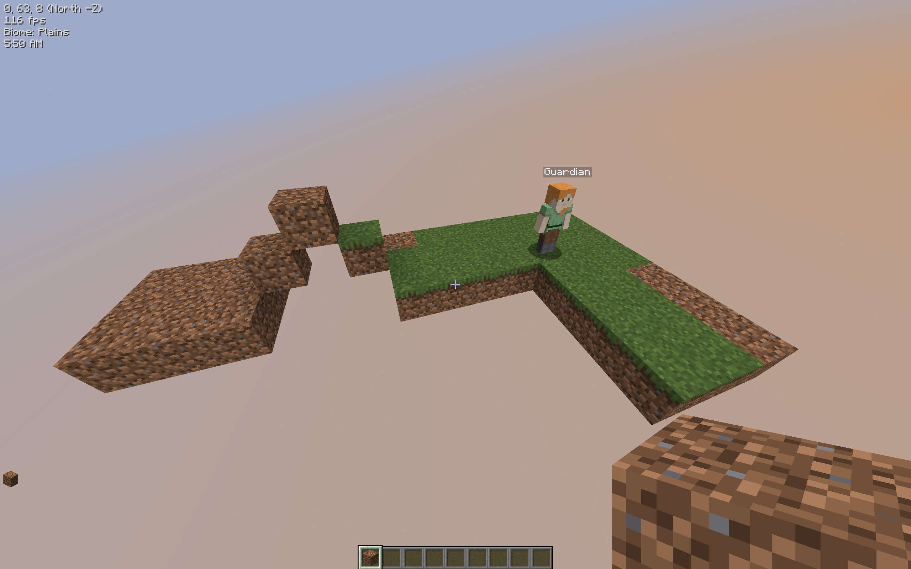
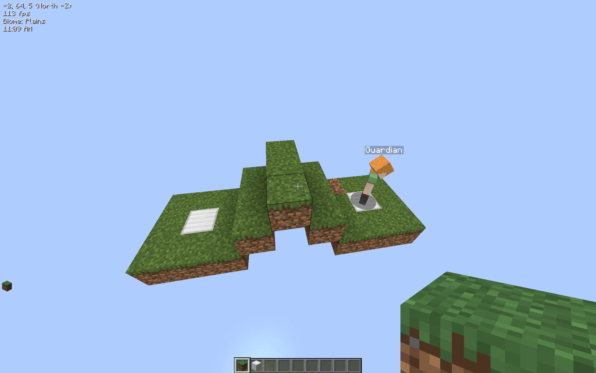
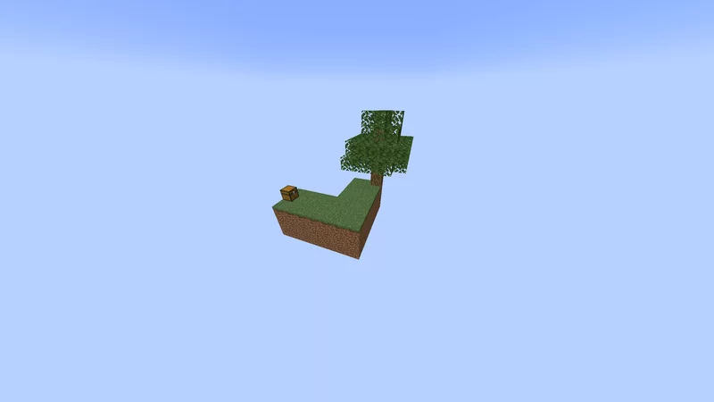
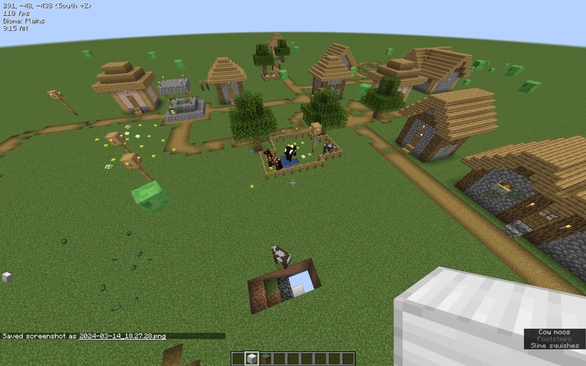
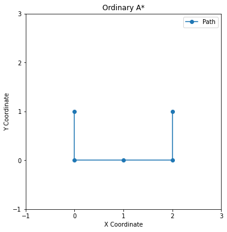
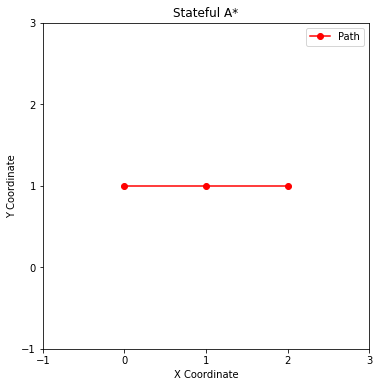
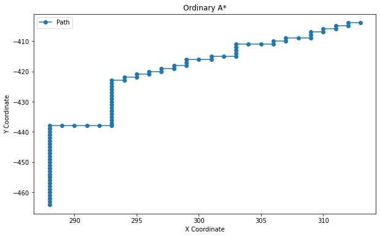
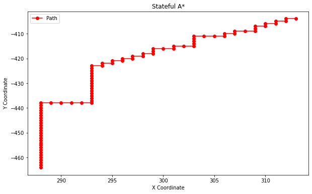

# CSE202WI24-proj

This is a project repo for CSE202, winter 2024.

We focus on solving pathfinding problems in Minecraft, a well-known sandbox game.

## Benchmark

credit: Yuchen, [https://github.com/DuckDuckWhaleUCSD](https://github.com/DuckDuckWhaleUCSD)

The minecraft map data is under the `benchmark` folder. We have a manually designed `simple` which consists of 11 blocks, and four other benchmarks `bridge`, `road`, `skyblock`, `superflat` imported from real minecraft map by using a custom Minecraft client. The client is prefered not to be open-sourced and thereby not presented here.

#### Example

| simple | bridge | road | skyblock | superflat |
|:------:|:------:|:----:|:--------:|:---------:|
|  |  |  |  |  |


## Stateful A* pathfinding

credit: Dawei Guo, [https://github.com/MronakX](https://github.com/MronakX)

The modified A* algorithm with resource is implemented in `build.ipynb`, where we also implemented a baseline ordinary A* algorithm. 

Modify the folloing line to whatever benchmark you want to test. Also customize the starting point and goal point to adapt the data.

```
world_txt_filename = 'benchmark/superflat/world-dump.txt'
```

#### Path Example (on x-y plane)

##### Simple

| A* | Stateful A* |
|:--:|:--:|
|  |  |

##### superflat

| A* | Stateful A* |
|:--:|:--:|
|  |  |